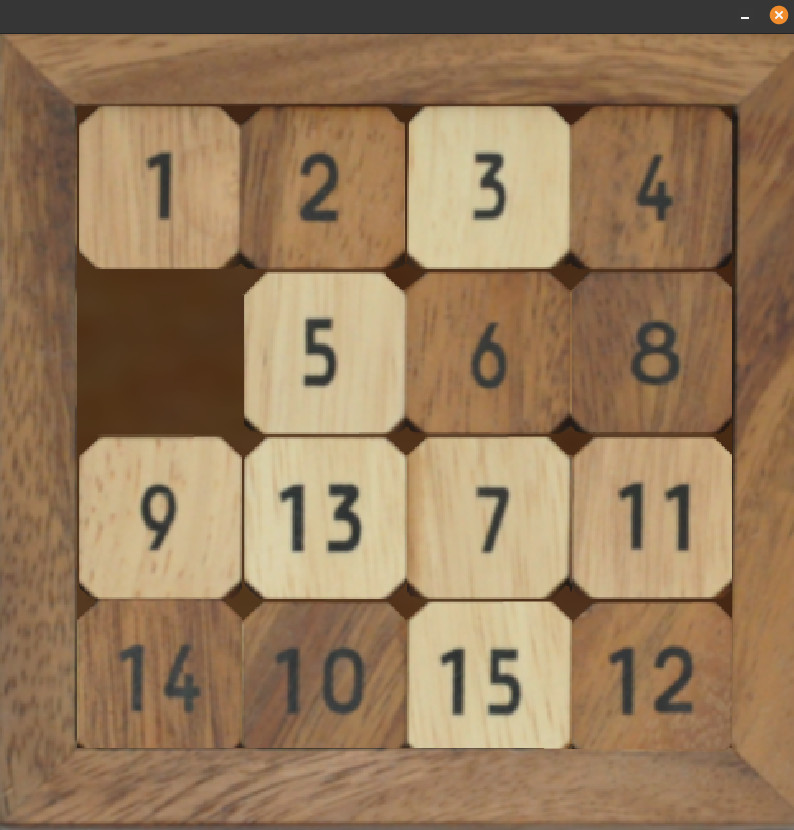

## 15-puzzle game

<!-- 
 -->

## Controls
Arrow keys to **move**

Space to **pause**

X-key to **shuffle**

S-key to **solve** by computer

## Compile and run
`make` to compile

`./_npuzzle` to run the program

## Warning

The program depends on Raylib for graphics

## To do / bugs
- The solver shits the bed on some inputs (the solutions are too long)
- Drag pieces with mouse ?
- Sounds ?